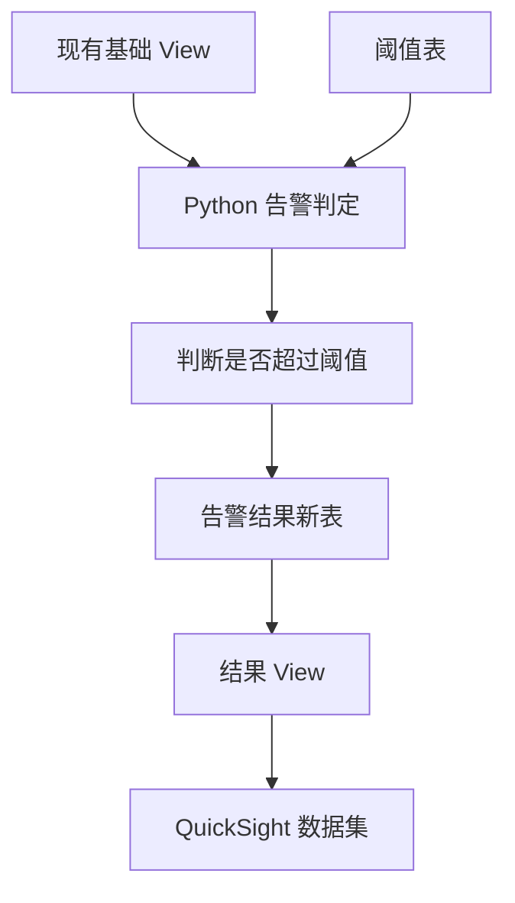

FYI
仔细看完后，这次会议已经正式从“SQL View 设计”进入“Python 告警逻辑开发”阶段。你接下来最主要的工作，是使用目前做好的基础 View 和阈值表，在 Python 中判断是否发生告警，并把判定结果保存到新表。

## 一、明确交给你的任务

### 1. 对现有 SQL 做最后的小修正和确认

SQL 的整体方案已经基本获得认可，不需要大改，但你还要处理以下几点：

#### ① 确认并整理重复的 `TERM_NUMBER = 1` 条件

会议中指出：

* 最下面的 `WHERE` 条件中已经有 `TERM_NUMBER = 1`
* 上面的 `SELECT CASE` 中似乎又判断了一次相同条件
* 对方认为 `WHERE` 中的条件需要保留
* 但 `CASE` 中的相同判断可能可以删除

你需要做的是：

* 确认删掉 `CASE` 中该条件是否影响结果
* 如果没有影响，就删除重复条件
* 保留 `WHERE` 中的 `TERM_NUMBER = 1`

这不是要求你立刻照删，而是先确认逻辑后整理。

---

#### ② 暂时保留 SQL 中的注释

会议最后确认：

* 当前开发用 SQL 可以继续保留详细注释
* 作为内部维护版本使用
* 最终正式输出时，注释可能会因为生成方式而消失
* 目前不需要专门删除注释

因此现在不必清理注释。

---

#### ③ 在仕様書中补充 View 的数据范围和限制

这是明确点名给你的文档任务。

目前这个基础 View：

* 包含确定错误相关数据
* 也包含重试错误相关数据
* 但是重试错误的重复数据并没有在 View 内完全排除
* 最终去重会在 Python 等后续处理阶段完成

因此需要在 View 的说明或仕様書中明确写清楚：

* View 包含什么数据
* 哪些处理已经完成
* 哪些处理没有完成
* 重试错误的重复数据仍然可能存在
* 使用时需要追加条件完成去重

可以考虑写成类似下面的日语：

> 本ビューには、確定エラーおよびリトライエラーの判定に必要なデータを保持する。
> ただし、リトライエラーについては、本ビュー内では重複除外を完了していないため、後続処理にて `RN_RETRY_TYPE = 1` の条件を指定し、重複を除外する必要がある。

具体字段名要根据你实际 SQL 调整。

---

### 2. 开始开发 Python 告警判定逻辑

这是你目前最优先的开发任务。

会议给出的处理流程是：



#### Python 的输入

需要读取两部分数据：

* 目前已经创建好的基础 View
* 阈值表（閾値テーブル）

#### Python 要执行的处理

大致需要：

1. 从基础 View 取得错误数据
2. 区分确定错误和重试错误
3. 对重试错误正确去重
4. 按日期、机种、错误类型等维度统计错误件数
5. 与阈值表匹配
6. 判断错误件数是否超过阈值
7. 将超过阈值的项目作为告警历史保存

会议中提到的核心判断是：

> 这一天、这个机种、这个错误类型的件数，是否超过对应阈值。

---

### 3. Python 中必须正确处理重试错误去重

这一点是本次会议中被反复确认的技术重点，很可能也是后面 Code Review 会重点检查的地方。

会议确认的逻辑大致是：

#### 确定错误

按照确定错误相应的标志或条件取得。

#### 重试错误

不能只使用：

```sql
ERROR_TYPE = 0
```

还必须追加类似：

```sql
AND RN_RETRY_TYPE = 1
```

原因是：

* `ROW_NUMBER()` / `PARTITION BY` 只是给重复数据编号
* 仅仅生成 `ROW_NUMBER()` 并不等于已经去重
* 必须只取 `ROW_NUMBER = 1` 的记录，才真正完成重复排除

也就是说，类似下面的条件才代表去重后的重试错误：

```sql
ERROR_TYPE = 0
AND RN_RETRY_TYPE = 1
```

字段名可能因转录错误不完全准确，你应以实际 SQL 为准。

---

### 4. 创建告警结果新表

会议明确认可了你的方案：创建一张新的结果表。

Python 处理完成后，需要把结果写入这个新表。新表主要用于保存：

* 哪一天发生告警
* 哪个机种
* 哪种错误
* 实际错误件数
* 对应阈值
* 是否超过阈值
* 告警发生记录或历史

会议并没有明确规定最终表的全部字段，所以表结构目前仍需要你先提出方案。

建议至少考虑：

* 判定日期
* 机种
* 错误代码／错误类型
* 错误分类（确定错误、重试错误）
* 实际件数
* 阈值
* 是否告警
* 登记时间／更新时间

但是这部分是合理设计建议，并不是会议已经确认的固定字段。

---

### 5. 整理 Python 的处理流程并向负责人共享

会议最后明确要求：

* 你先考虑 Python 应该采用什么处理流程
* 有了大致构想之后，再向负责人共享
* 如果有问题，及时联系

这意味着你不应该直接写完所有代码后才说明，而是最好先形成一个简单设计，例如：

1. 从 View 取得数据
2. 分别统计确定错误和重试错误
3. 重试错误使用 `RN_RETRY_TYPE = 1` 去重
4. 按日期、机种、错误类型汇总
5. 读取阈值
6. 根据共同字段匹配
7. 判断是否超限
8. 将结果写入告警结果表

然后把这个流程发给细田桑或相关负责人确认。

---

## 二、当前的优先顺序

会议已经明确决定：

1. 先完成 Alert 告警功能
2. 不良率功能暂时不做
3. 告警处理完成后，再单独开发不良率功能

所以你现在不要先去做“不良率”。

你当前最优先的是：

> Python读取现有View和阈值表 → 判断是否超过阈值 → 将结果保存到新的告警结果表。

---

## 三、QuickSight 部分怎么处理

会议对 QuickSight 的要求是：

* Python 将结果写入新表
* 不建议直接把结果表作为 QuickSight Dataset
* 应先基于结果表创建一个 View
* 再把该 View 作为 QuickSight Dataset 的数据源

也就是：

```text
Python
  ↓
告警结果表
  ↓
QuickSight用View
  ↓
QuickSight Dataset
```

原因是以后如果表增加字段，直接使用表作为 Dataset，维护起来会比较麻烦。

不过负责人也明确说了：

> 当前第一优先是先创建结果表，QuickSight 的 View 和 Dataset 可以之后处理。

因此你现在暂时不用先做 QuickSight 画面。

---

## 四、不需要你负责的事项

### 1. 向客户确认“14天”的时间精度

会议发现规格书只写了“14天”，但没有明确：

* 按日期判断即可
* 还是需要精确到时、分、秒
* 当前是否允许把时间截断为日期

会议最后表示，这个问题由负责人向客户确认。

所以你现在：

* 不需要自己联系客户
* 不要自行决定只按日期判断
* 等负责人确认结果
* 如果 Python 逻辑暂时涉及这部分，最好把时间判定写成容易调整的形式

---

### 2. `NUMBER_OUT` 条件不需要再问客户

关于 `NUMBER_OUT` 或重试相关空值的条件，对方明确说：

* 这是必要条件
* 不加会漏掉应该取得的数据
* 不需要特意询问客户
* 按目前修正后的方式处理即可

---

### 3. 不良率功能暂缓

这部分虽然在会议中讨论了，但明确决定放到 Alert 之后，所以不是你明天马上要做的内容。

---

## 五、你接下来实际应该做什么

建议按这个顺序推进：

1. 确认 `CASE` 中重复的 `TERM_NUMBER = 1` 是否可以删除。
2. 保留 `WHERE` 中必要条件。
3. 验证最终错误件数，尤其是重试错误是否通过 `RN_RETRY_TYPE = 1` 正确去重。
4. 在仕様書中补充 View 包含的数据范围及“重试错误尚未在 View 内去重”的说明。
5. 设计告警结果表结构。
6. 整理 Python 处理流程，并先向负责人共享。
7. 开发 Python：

   * 读取基础 View
   * 读取阈值表
   * 统计确定错误与重试错误
   * 去重
   * 匹配阈值
   * 判断告警
   * 写入结果表
8. 结果表完成后，再创建 QuickSight 用 View。
9. 最后再连接到 QuickSight Dataset。

## 最重要的结论

你现在被明确要求做的核心工作是：

> 使用现有基础 View 和阈值表开发 Python 告警判定逻辑，把超过阈值的结果作为历史记录写入一张新的结果表。

同时注意两个关键点：

* 重试错误必须使用 `RN_RETRY_TYPE = 1` 之类的条件真正完成去重。
* 当前 View 没有完全排除重试重复数据，这一点必须写进仕様書。

会议中的时间表达是“明日から実際のロジック部分に入る”，因此理解为从明天开始正式进入 Python 逻辑开发是最稳妥的。
