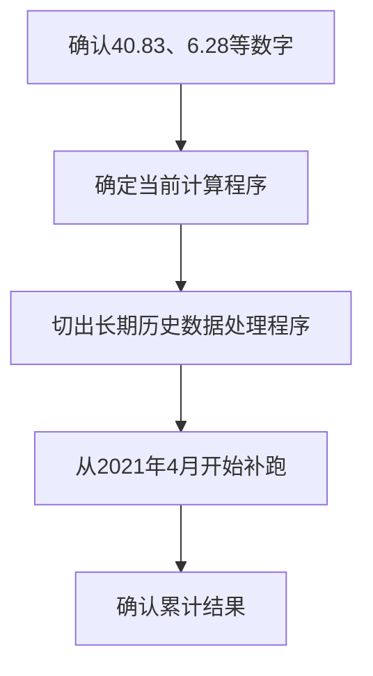

这次会议的核心结论是：你的“长期数据功能”整体逻辑基本获得认可，画面也被认为没有技术难点。现在最重要的不是继续做画面，而是证明画面上的数字是正确的。

## 一、上级对当前成果的评价

整体评价偏正面：

* 已经确认了你提交的内容和源码。
* 认为整体逻辑基本符合预期。
* 短期与长期功能大量复用，所以现在做成这样是合理的。
* 判断逻辑方面暂时没有发现明显问题。
* 长期功能实际上已经接近完成。

不过，有一个关键问题还没有通过确认：

> 不能只是看到画面上出现了数字，就判断测试通过。必须确认数字的计算依据和最终结果都正确。

## 二、下周最优先的任务：确认数字的妥当性

上级反复强调了这一点。

目前画面上有类似：

* `40.83`
* `6.28`

这样的平均值。你需要确认的不只是“程序执行后显示了这些数字”，而是：

1. 原始数据到底有多少件。
2. 作为分母的天数是否正确。
3. 计算过程是否正确。
4. 四舍五入后的显示结果是否正确。
5. 短期、长期两个指标都要分别确认。

例如会议中提到：

* 某个实际件数 ÷ 30天＝40.83
* 某个实际件数 ÷ 180天＝6.28

上级的意思是，你必须能够说明：

> 数据库中的实际件数是多少，因此除以30或180之后，结果确实应该是40.83或6.28。

目前DEV环境与生产环境的数据不同，所以上级只看画面无法判断这些值是否正确，需要你从后台数据、SQL查询结果或原始数据件数进行核对。

建议留下如下证据：

* 查询对象期间
* 原始件数
* 分母天数
* 手工计算结果
* 程序计算结果
* QuickSight画面显示结果
* 三者是否一致

## 三、源码需要修改一处

上级指出有一处源码写法“非常别扭/看着不舒服”：

> あまりにも気持ち悪いソースすぎるので、直しておいてください。

这不是说整个源码有问题，只是屏幕共享时指出的某一处需要整理。由于文字记录没有保留具体代码，所以需要根据你当时记下的位置修改。

另外，上级也提到代码换行过多，不过态度是：

* 确实有些在不必要的位置换行。
* 看起来比较零碎。
* 但不算错误。
* 暂时可以不作为重点修改。

因此，真正必须修改的是他在屏幕上明确指出的那一处。

## 四、长期画面不需要投入太多时间

关于长期的履历、检索及分析画面，上级认为：

* 短期与长期的操作基本相同。
* 区别只是使用的数据不同。
* 画面本身已经证明能够制作。
* 已经做出来也没问题，但继续花大量时间没有意义。

所以下周的优先级是：

1. 数字妥当性确认
2. 必要的源码修正
3. 后台程序和历史数据处理
4. 测试书制作
5. 画面细节完善

换句话说，暂时不要把主要精力放在QuickSight画面调整上。

## 五、不良率相关工作

会议中你提到不良率部分还没有全部着手，上级认为剩余工作并不多：

* 基本上按照短期功能的做法复制。
* 创建必要的表或View。
* 制作对应的QuickSight Visual。
* 不需要重新设计不良率的计算逻辑。
* 不应该需要两三天以上。

你回答预计下周内可以完成，但上级倾向认为：

> 如果只是复用短期部分，实际开发可能一天左右就能完成。

这里需要注意：不要为了证明进度快而匆忙完成，数字验证仍然比画面完成时间重要。

## 六、ECS测试优先级很低

上级明确表示：

* ECS测试不用花太多时间。
* 短期程序已经能够运行。
* 长期程序只是把处理期间进行了扩展。
* 因此原则上没有理由短期能运行、长期却不能运行。
* ECS测试一直都是低优先级。

所以不要因为ECS测试拖慢数字验证和测试书制作。

但这并不等于完全不测试，而是：

> 做最低限度的运行确认即可，不需要在ECS测试上投入大量时间。

## 七、长期历史数据需要从2021年4月开始补跑

长期功能也需要像短期功能一样，执行一次过去数据的累计处理：

* 对象开始时间：2021年4月
* 需要一次性处理过去的数据
* 需要把历史数据处理程序单独切出来
* 做法参考短期的历史数据处理程序

正确顺序是：

上级特别要求：必须先确认数字正确，再把程序固定下来，最后才制作和执行历史数据处理程序。

## 八、测试书可以继续制作

虽然生产环境投入时间要调整，但后台实际工作可以继续：

* 编写长期功能的测试书。
* 准备必要的表、View等部件。
* 在DEV环境确认View是否可以正常使用。
* 准备历史数据处理程序。
* 继续完成尚未完成的内部工作。

会议中有一句转写成了“両立のビュー1つ”，这里很可能是语音识别错误。结合上下文，它表达的应该是：

> 确认长期功能使用的View在DEV环境是否可以正常建立、使用或接入。

## 九、生产环境投入时间由上级控制

记录中多次出现的“プロット”大概率是语音识别把 `PROD` 识别错了，实际应该是在说生产环境。

上级的安排是：

* 不要下周马上把长期程序全部投入生产环境。
* 生产环境投入的时间由他来调整。
* 表、View、测试书等准备工作可以提前完成。
* 最后只控制“什么时候把程序放入PROD”。

原因不是功能存在问题，而是当前对客户提交的计划显示：

> 长期功能预计会占用整个9月。

但实际上你做得比计划快。如果马上告诉客户已经完成，客户可能会觉得原计划估算过长。因此，上级准备分阶段展示进度。

会议中的“騙し騙し”“小出しにしていく”并不是让你伪造结果，而是表示：

* 对外不要一次性公布全部进度。
* 由上级控制向客户展示的节奏。
* 内部开发仍然正常提前推进。
* 预计对客户展示的完成时间大约是9月25日前后。

你不需要主动向客户说明“实际上已经快做完了”，进度的对外说明交给上级处理。

## 十、剩余时间会安排下一项工作

如果长期功能提前完成，空出来的时间不会闲置。上级提到了下一阶段的“保証延長”相关内容：

* 原计划从10月开始。
* 可以提前查看需求。
* 提前考虑应该如何制作。
* 先做调查、方案讨论和设计准备。

这说明目前不是“你的工作要结束了”，而是长期任务提前完成后，会让你提前研究下一项功能。

## 你下周可以这样安排

### 最高优先级

* 核对30天平均值。
* 核对180天平均值。
* 从数据库确认原始件数。
* 手工计算并与程序及画面结果比较。
* 同时确认两个指标。

### 第二优先级

* 修改会议中指出的那一处源码。
* 确认长期用View在DEV环境中的结果。
* 完善长期功能测试书。

### 第三优先级

* 切出从2021年4月开始处理的历史数据程序。
* 在数字确认完成后固定程序。
* 准备过去数据的一次性补跑。

### 暂时不要优先处理

* 生产环境正式投入。
* 大量ECS测试。
* 继续细化与短期基本相同的QuickSight画面。
* 自行决定向客户公开实际完成进度。

总体来说，这次不是对你的成果进行否定。上级已经基本认可功能和逻辑，现在只是要求把“数字正确性”证明得更扎实。最需要避免的是：只凭QuickSight显示出了数字，就认为测试完成。
